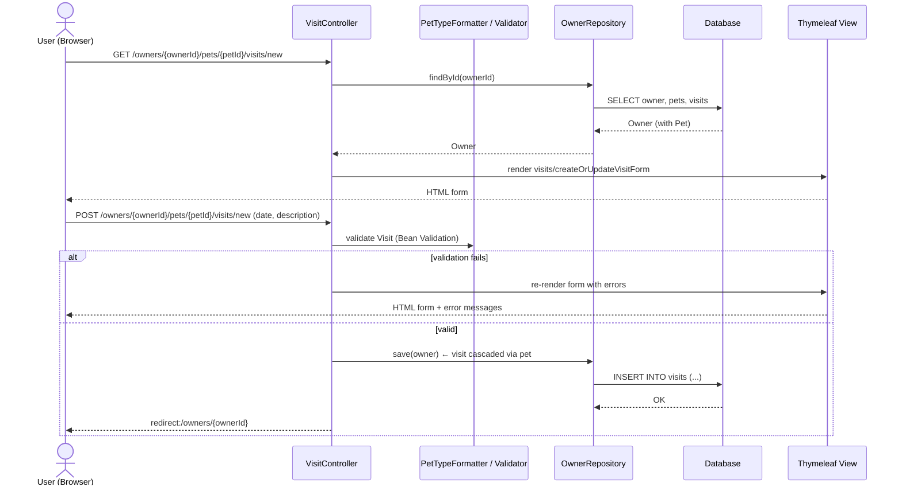

# Spring PetClinic Architecture

## Overview

Spring PetClinic is the canonical Spring Boot sample application: a classic server-rendered web app for managing a veterinary clinic — owners, their pets, vet visits, and the vet directory. It demonstrates the standard Spring Boot layered architecture (controller → repository → JPA entity → relational DB) with Thymeleaf server-side rendering, Bean Validation, caching, and Actuator monitoring. Single deployable: one executable JAR, no microservices.

## Diagram

```mermaid
graph TD
    Browser([Browser]) -->|HTTP| WC[Web Layer<br/>Spring MVC Controllers]

    subgraph App["PetClinicApplication (Spring Boot, single JAR)"]
        subgraph Controllers["Web Layer (@Controller)"]
            OC[OwnerController<br/>/owners/*]
            PC[PetController<br/>/owners/{id}/pets/*]
            VC2[VisitController<br/>/owners/{id}/pets/{id}/visits/new]
            VC[VetController<br/>/vets, /vets.html]
            WC2[WelcomeController / CrashController<br/>/ , /oups]
        end

        subgraph Domain["Domain Layer (by business capability)"]
            OwnerPkg[owner package<br/>Owner, Pet, Visit, PetType<br/>PetValidator, PetTypeFormatter]
            VetPkg[vet package<br/>Vet, Specialty, Vets]
        end

        subgraph Persistence["Persistence Layer (Spring Data JPA)"]
            OR[OwnerRepository]
            VR[VetRepository]
        end

        Cache[(JCache<br/>vet list cache)]
        View[Thymeleaf templates<br/>+ WebJars Bootstrap]
    end

    OC --> OwnerPkg
    PC --> OwnerPkg
    VC2 --> OwnerPkg
    VC --> VetPkg
    OwnerPkg --> OR
    VetPkg --> VR
    VR -.->|@Cacheable 'vets'| Cache
    Controllers --> View -->|HTML| Browser
    VC -->|JSON/XML accept header| Browser
    OR -->|JPA / Hibernate| DB[(Relational DB<br/>H2 default · MySQL · PostgreSQL · HSQLDB)]
    VR -->|JPA / Hibernate| DB

    Actuator[Spring Actuator<br/>/actuator/*] -.-> App
```

## Components

| Component | Responsibility | Key tech |
|---|---|---|
| `PetClinicApplication` | Bootstraps the app | Spring Boot, `@SpringBootApplication` |
| `owner/OwnerController` | Find/create/edit owners, owner detail page | Spring MVC, Bean Validation |
| `owner/PetController` | Add/edit pets per owner | Spring MVC |
| `owner/VisitController` | Record vet visits | Spring MVC |
| `vet/VetController` | Vet directory — HTML (`/vets.html`) or JSON/XML (`/vets`) | Spring MVC, content negotiation |
| `system/WelcomeController`, `CrashController` | Home page; deliberate exception endpoint to demo error handling | Spring MVC |
| `model/` | Shared base classes: `BaseEntity` (id), `NamedEntity`, `Person` | JPA mapped superclasses |
| `owner/*Repository`, `vet/VetRepository` | Data access | Spring Data JPA (derived queries) |
| `system/CacheConfiguration` | Caches the vet list (rarely changes) | spring-boot-starter-cache, JCache |
| `messages/messages*` | i18n (English/German/Spanish) | Spring MessageSource |
| Actuator | Health/metrics endpoints (all exposed) | spring-boot-starter-actuator |

## Data flow

Typical request (e.g. "add a pet"):

1. Browser POSTs to `/owners/{ownerId}/pets/new`.
2. Spring MVC routes to `PetController`; `PetTypeFormatter` converts pet-type strings to `PetType` entities; `PetValidator` + `@Valid` enforce constraints — failures re-render the form with errors.
3. Controller loads the `Owner` via `OwnerRepository`, attaches the `Pet`, and saves (cascade via JPA).
4. Hibernate issues SQL to the configured database; schema/data seeded at startup from `src/main/resources/db/${database}/schema.sql` + `data.sql`.
5. Redirect → owner detail page rendered by Thymeleaf from `src/main/resources/templates/`.

For `/vets.html`, `VetController` reads via the `@Cacheable("vets")`-backed `VetRepository`, so repeat views skip the database.

## Key decisions

- **Monolith by design** — it's a teaching app; one JAR, embedded Tomcat.
- **Packages organized by business capability** (`owner`, `vet`, `system`) rather than by layer — the classic "package by feature" Spring sample.
- **JPA with `ddl-auto=none`** — schema is managed by versioned SQL scripts per database, not Hibernate auto-DDL.
- **Pluggable databases** at runtime via the `database` property (H2 default; MySQL/Postgres profiles).
- **No Dockerfile** — container images built via `./mvnw spring-boot:build-image` (Cloud Native Buildpacks).
- **Server-side rendering only** — Thymeleaf + WebJars (Bootstrap 5, Font Awesome); no SPA/REST frontend.

## Risks / open questions

- `management.endpoints.web.exposure.include=*` exposes **all** actuator endpoints — fine for a demo, must be restricted before any real deployment.
- `spring.jpa.open-in-view=true` — convenient but can mask N+1 query issues.
- This old version contains extra devops artifacts (`jenkinsfile`, `deployansible.yml`, `server.inv`) that are stale relative to the current GitHub Actions build in upstream.

## Sequence: recording a vet visit


